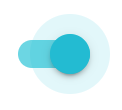

  

<h2 align="middle">자바스크립트 기초 Study</h2>

자바스크립트 기초를 다지는 토글토글 스터디

 
 

## 🔥 Goal

- 자바스크립트 기초를 탄탄히 다진다.
- 레벨 1에서 다뤘던 내용들에 대해 이해가 되지 않는 부분은 그냥 넘어가지 않는다.
- 미션을 진행하며 궁금했던 점/어려웠던 점에 대해 정리하고 공부해본다.

---

## 🧡 지난 스터디

<a href="./Level 1 /README.md">👉 Level 1 Study Archive 바로가기 </a>

## 🐛🐛 Level 2 - TimeLine [04.12 - ]

## 0. Schedule & Rules

- 테코톡 주제, 지금까지 배웠던 내용들에 대한 Deep한 토론
- 각 주차별 토론에 대해 기록한다.

### Schedule 
- 매주 `일`:`22:00`/`월`:`10:00`  중 택 1
- 시작: `4.18(일)`: `22:00`
  - 주차 별 취합할 사람 랜덤으로 뽑아서 정리하기

- 매주 수요일 23:59 까지 질문을 [Issue](https://github.com/toggle-toggle/javascript-basic/issues)로 정리해 [프로젝트](https://github.com/toggle-toggle/javascript-basic/projects/1)에 올려놓는다.
- ❌ 어기게 되면 커피 쏘기☕️

### Rules
- 6명이 모두 질문을 준비해온다.
- 스터디 당일 질문을 보고 겹치는 것이 있거나 Grouping할 것이 있다면 함께 어떤 질문에 대해 토론할 것인지 정한다.
- 각자 1명씩 돌아가면서 공부한 내용을 이야기한다.
- 토론한다.

- 스터디가 끝난 후, 48시간 이내에 질문에 대한 답변과 피드백을 [Issue](https://github.com/toggle-toggle/javascript-basic/issues)에 정리한 후에 취합할 사람에게 전달
- ❌ 어기게 되면 커피 쏘기☕️

## 1. Table of Contents

### 스터디
1. [[21.04.18] DOM & BOM](https://github.com/toggle-toggle/javascript-basic/blob/master/Level%202/%5B0418%5D_DOM_&_BOM.md)

### 테코톡

1. [주모] DOM & BOM
2. [그루밍] This
3. [신세한탄] Prototype
4. [브콜] Event Loop
5. [엘라] Scope & Closure
6. [티케] Callback
7. [주모] SPA

### 배웠던 내용

1. DOM & BOM
2. Event
3. Javascript Data Type
4. SetTimeout
5. SetInterval
6. Request Animation Frame
7. Event Loop
8. CSS: Layout, Box Model, Position, FlexBox
9. Object
10. Prototype & Mixin
11. Execution Context & Scope & Closure
12. Module & State Management
13. 웹의 동작
14. Ajax & Json
15. Restful API
16. Promise
17. Loading & Skeleton UI
18. Lazy Loading
19. Debounce, Throttle
20. CSS: Grid Layout
21. SPA
22. Routing
23. Webpack & Module Bundler
24. Login with JWT(Json Web Token)

## 2. Reference

[우아한 테크코스 테코톡 영상](https://www.youtube.com/playlist?list=PLgXGHBqgT2TvpJ_p9L_yZKPifgdBOzdVH)

## 3. Timeline
